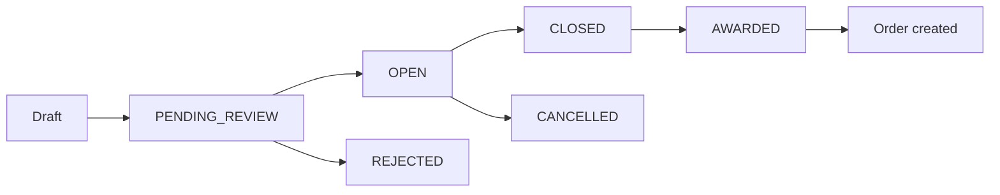
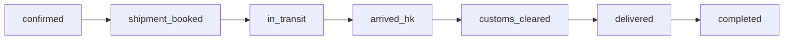
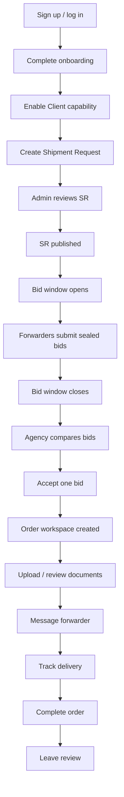
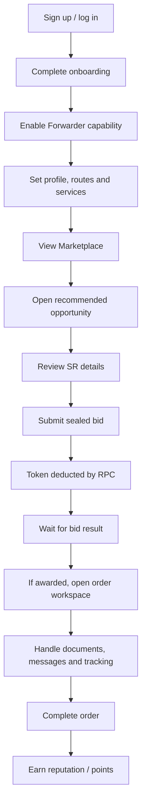
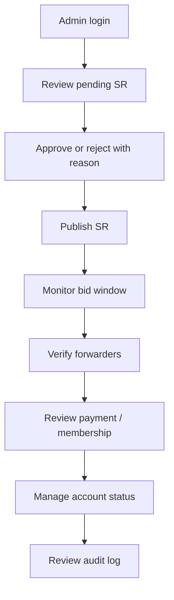
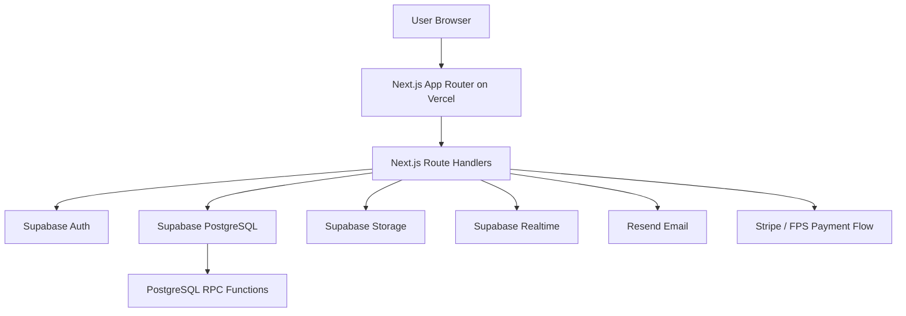

# LBID Website System Guide, User Guide And Architecture

Version: 2026-06-28  
Product: LBID - Logistics Bidding Platform  
Primary stack: Next.js 14 App Router, Supabase, Vercel  
Production URL: https://lbid.vercel.app

---

## 1. Executive Summary

LBID is a sealed-bidding logistics marketplace for matching overseas logistics demand with Hong Kong forwarders.

The platform helps Southeast Asian and overseas agencies submit Shipment Requests (SR), then allows qualified Hong Kong logistics providers to submit confidential sealed bids. After the bidding window closes, LBID highlights the lowest valid quote, but the client may still choose another forwarder based on route fit, service quality, reputation, transit time, compliance, or trust.

The current product direction is not a simple directory and not a generic quotation form. It is a workflow platform with:

- Structured shipment request intake
- Admin-controlled request review
- Fixed bidding window
- Sealed bid submission
- Token-based bid transaction
- Quote comparison and award
- Order workspace
- Document, message, tracking, review and audit flows

---

## 2. Product Positioning

### Core Positioning

LBID helps overseas agencies and Hong Kong forwarders build fair, transparent and repeatable logistics partnerships.

### Brand Promise

Traditional Chinese:

> 讓價格回到公平，讓實力取代關係。

English:

> Fair prices. Real capability. No connections needed.

### Platform Role

LBID is a workflow platform, not the carrier of record.

Internal platform role:

`workflow_platform_not_carrier_of_record`

This means LBID provides matching, bid workflow, document workflow, communication tools, audit trail and marketplace governance. Actual freight service responsibility remains with the selected forwarder and relevant contracting parties.

---

## 3. User Model

LBID uses a company account model rather than locking users into only one role.

### Company Capabilities

One company account can enable:

| Capability | Meaning | Main Actions |
| --- | --- | --- |
| Client capability | Company can create shipment demand | Create SR, compare bids, accept bid, manage order |
| Forwarder capability | Company can win logistics work | View marketplace, submit sealed bid, manage awarded order |
| Admin capability | Platform operator | Review SR, verify accounts, manage payments, audit activity |

### Why This Matters

In logistics, one company can sometimes act as a client on one shipment and as a forwarder on another. Therefore, LBID should not treat "Agency" and "Forwarder" as permanent account types. They are capabilities within the same company account.

---

## 4. Main Business Mechanisms

## 4.1 Shipment Request Mechanism

An SR is the core demand object.

Typical SR information:

- Origin
- Destination
- Cargo type
- Weight
- CBM / volume
- Freight mode: air / sea
- Pickup date
- Estimated delivery date
- Services needed
- Incoterms
- Notes
- Bid deadline
- Request status

SR lifecycle:

Important rule:

- A new SR should enter manual review first.
- Admin publishes the SR only after checking data quality.
- The sealed bid window opens after publication.

## 4.2 Sealed Bid Mechanism

Forwarders submit exactly one sealed bid per SR.

During the bid window:

- Forwarders cannot see competitor prices.
- Forwarders cannot see competitor identities.
- Agency cannot compare full bid details until the bid window closes.
- Bid submission uses token logic.

Bid fields:

- SR ID
- Forwarder ID
- Price
- Currency
- Transit time
- Terms
- Submitted time

## 4.3 Token Mechanism

Tokens are used to submit bids and potentially activate marketplace growth features.

Current intended bid rule:

- Submitting one sealed bid deducts token balance through Supabase RPC.
- Token deduction and bid creation must happen transactionally.
- If bid creation fails, token should not be deducted.
- If token is insufficient, bid should not be created.

Critical RPC:

- `submit_bid_with_token`
- `adjust_token_balance`

Token ledger table:

- `token_transactions`

This is important because token balance is commercial value. It cannot be handled by frontend-only logic.

## 4.4 Award Mechanism

LBID uses a hybrid award model.

After the bid window closes:

1. Agency opens Quote Comparison.
2. LBID shows all valid bids.
3. Lowest valid bid is highlighted.
4. Agency may select the lowest bid.
5. Agency may also select a non-lowest bid.
6. If selecting non-lowest bid, LBID should show confirmation explaining price difference.
7. On award, contact details unlock and an order workspace is created.

Why this is useful:

- It preserves price transparency.
- It does not force the client to choose a weak service provider only because price is lowest.
- It supports value-based decision making.

## 4.5 Order Mechanism

After bid acceptance, an order is created.

Order status pipeline:

Order workspace contains:

- Order summary
- Shipment route
- Quotation amount
- Forwarder / client relation
- Documents
- Messages
- Tracking
- Review
- Audit-related events

## 4.6 Document Mechanism

Documents are managed per order.

Core document types:

- AWB
- B/L
- Commercial Invoice
- Packing List
- Certificate of Origin
- Customs Declaration

Document functions:

- Upload
- Storage reference
- Missing document checklist
- Reminder
- Link to order status

## 4.7 Messaging Mechanism

Messages are attached to each order.

Purpose:

- Avoid external email fragmentation
- Keep logistics decisions and confirmations traceable
- Notify counterparties when new message arrives

Message data:

- Order ID
- Sender ID
- Content
- Created time

## 4.8 Tracking Mechanism

Tracking events are attached to each order.

Each tracking event contains:

- Order ID
- Status
- Location
- Description
- Occurred time
- Created by

This provides an operational history separate from simple order status.

## 4.9 Membership Mechanism

Planned membership tiers:

| Tier | Intended Position |
| --- | --- |
| Free | Entry-level access and limited visibility |
| Standard | Monthly paid member, basic growth tools |
| Premium | Higher visibility and stronger growth tools |
| Partner | Strategic partner or manually managed account |

Membership affects:

- Directory visibility
- Token packages
- Profile badge
- Priority access
- Potential platform perks

## 4.10 Points And Referral Mechanism

Points can be earned from:

- Completed orders
- Positive reviews
- Fast response
- Referral activation
- Verified profile milestones

Points can potentially be used for:

- Profile boost
- Subscription discount
- Event tickets
- Platform perks

Referral system:

- Each user/company can have a referral code.
- Referral creates point event after valid transaction.

---

## 5. End-To-End Workflow

## 5.1 Client / Agency Flow

## 5.2 Forwarder Flow

## 5.3 Admin Flow

---

## 6. Page Guide

## 6.1 Public / Auth Pages

| Page | Path | Purpose | Main Actions |
| --- | --- | --- | --- |
| Login / Sign up | `/zh/auth` | Entry point for unauthenticated users | Login, sign up, bootstrap profile |
| Product preview | `/zh/product-preview` | Public / preview demo | View product story |
| Demo cases | `/zh/demo-cases` | Show demo scenarios | Review example workflows |

Current rule:

- If user is not logged in, protected pages redirect to auth.

## 6.2 Core Workspace Pages

| Page | Path | Purpose | Current Integration |
| --- | --- | --- | --- |
| Dashboard / Today | `/zh/dashboard` | Show next actions | Live `/api/workspace` |
| Marketplace | `/zh/marketplace` | View open SR opportunities | Live `/api/workspace` |
| Quote Console | `/zh/marketplace/[id]` | Submit sealed bid | Live `/api/shipment-requests/[id]`, `/api/bids` |
| My Requests | `/zh/requests` | Client SR list | UI exists; further API binding recommended |
| Request Detail | `/zh/requests/[id]` | Review SR detail | UI exists; further API binding recommended |
| Quote Comparison | `/zh/quotations/compare` | Compare bids and accept | Live `/api/bids`, `/api/bids/[id]/accept` |
| Orders | `/zh/orders` | View awarded work | UI exists; further API binding recommended |
| Order Workspace | `/zh/orders/[id]` | Manage order operations | Live order/doc/message/tracking APIs |

## 6.3 Forwarder Growth Pages

| Page | Path | Purpose |
| --- | --- | --- |
| Active Bids | `/zh/active-bids` | Track submitted sealed bids |
| My Routes | `/zh/my-routes` | Manage route coverage |
| Analytics | `/zh/analytics` | View performance metrics |
| Directory | `/zh/forwarders` | Public forwarder directory |
| Forwarder Profile | `/zh/forwarders/[slug]` | Public company profile |

## 6.4 Account Pages

| Page | Path | Purpose |
| --- | --- | --- |
| Onboarding | `/zh/onboarding` | Set company profile and capabilities |
| Company Profile | `/zh/profile` | Manage company data |
| Token Wallet | `/zh/tokens` | View token balance and ledger |
| Membership | `/zh/subscription` | Manage plan / payment |
| Notifications | `/zh/notifications` | Read platform updates |

## 6.5 Community Pages

| Page | Path | Purpose |
| --- | --- | --- |
| Community | `/zh/community` | Member updates, platform announcements, events |

## 6.6 Admin Pages

| Page | Path | Purpose |
| --- | --- | --- |
| Admin Dashboard | `/zh/admin` | Platform overview |
| Admin SR Review | `/zh/admin/shipment-requests` | Approve / reject SR |
| Admin Accounts | `/zh/admin/accounts` | Manage company verification and membership |
| Admin Payments | `/zh/admin/pending-payments` | Review manual payments |
| Admin Audit | `/zh/admin/audit` | Review critical activity |

---

## 7. Backend And API Guide

## 7.1 API Principles

Frontend should not directly perform sensitive database writes.

Rules:

- Client components call Next.js API route handlers.
- Route handlers verify Supabase session.
- Sensitive writes use Supabase service role or RPC.
- Token deduction must happen through database transaction / RPC.
- Admin, payment, membership, bid award and order status changes should be auditable.

## 7.2 Core API Endpoints

| Endpoint | Method | Purpose |
| --- | --- | --- |
| `/api/auth/bootstrap` | POST | Create initial user/company profile after sign up |
| `/api/company-profile` | GET / PATCH | Read or update company profile |
| `/api/workspace` | GET | Aggregated dashboard data |
| `/api/shipment-requests` | GET / POST | List or create SR |
| `/api/shipment-requests/[id]` | GET / PATCH | Read or update SR |
| `/api/shipment-requests/[id]/cancel` | POST | Cancel SR |
| `/api/bids` | GET / POST | List bids or submit sealed bid |
| `/api/bids/[id]/accept` | POST | Accept selected bid and create order |
| `/api/orders/[id]` | GET / PATCH | Read order or update order status |
| `/api/orders/[id]/documents` | GET / POST | Manage order documents |
| `/api/orders/[id]/messages` | GET / POST | Manage order messages |
| `/api/orders/[id]/tracking` | GET / POST | Manage tracking events |
| `/api/notifications` | GET / POST / PATCH | Notification centre |
| `/api/subscriptions` | GET | Read subscription |
| `/api/subscriptions/checkout` | POST | Start payment checkout |
| `/api/subscriptions/webhook` | POST | Payment webhook |
| `/api/tokens` | GET | Read token wallet |
| `/api/tokens/purchase` | POST | Purchase tokens |
| `/api/admin/shipment-requests` | GET / PATCH | Admin SR review |
| `/api/admin/accounts` | GET / PATCH | Admin account management |
| `/api/admin/pending-payments` | GET / POST | Manual payment review |
| `/api/admin/audit-logs` | GET | Admin audit trail |

## 7.3 Current Live API Binding

The following core pages currently use live backend data:

| Frontend Page | Backend APIs |
| --- | --- |
| Dashboard | `/api/workspace` |
| Marketplace | `/api/workspace` |
| Quote Console | `/api/shipment-requests/[id]`, `/api/bids` |
| Quote Comparison | `/api/workspace`, `/api/shipment-requests/[id]`, `/api/bids`, `/api/bids/[id]/accept` |
| Order Workspace | `/api/orders/[id]`, `/api/orders/[id]/documents`, `/api/orders/[id]/messages`, `/api/orders/[id]/tracking` |

---

## 8. Database Architecture

## 8.1 Key Tables

| Table | Purpose |
| --- | --- |
| `users` | User identity and role metadata |
| `company_profiles` | Company profile, capability flags, token balances |
| `subscriptions` | Membership and billing state |
| `shipment_requests` | Client demand records |
| `bid_recommendations` | Forwarder-SR matching recommendations |
| `bids` | Sealed bid records |
| `quotations` | Quotation generated from accepted bid |
| `orders` | Awarded order workflow |
| `documents` | Order document records |
| `messages` | Order communication thread |
| `tracking_events` | Order tracking timeline |
| `reviews` | Post-completion reviews |
| `token_transactions` | Token ledger |
| `points_transactions` | Points ledger |
| `referrals` | Referral tracking |
| `notifications` | In-app notifications |
| `payment_intents` | Manual or online payment records |
| `audit_logs` | Sensitive action history |

## 8.2 Critical RPC Functions

| RPC | Purpose |
| --- | --- |
| `submit_bid_with_token` | Create bid and deduct token in one transaction |
| `adjust_token_balance` | Admin/system token balance adjustment |
| `accept_bid_to_order` | Accept bid and create quotation/order/match record |

## 8.3 Storage

Supabase Storage is used for:

- Uploaded order documents
- Generated quotation PDF
- Generated AWB PDF
- Payment proof files

Recommended bucket:

- `documents`

---

## 9. System Architecture

## 9.1 High-Level Architecture

## 9.2 Frontend Architecture

Main frontend directories:

- `src/app`
- `src/components`
- `src/components/workspace`
- `src/components/figma-25jun-source`
- `src/lib`

Important frontend components:

| Component | Purpose |
| --- | --- |
| `SiteShell` | App shell, sidebar, top bar, account status |
| `SessionGate` | Redirect unauthenticated users to auth page |
| `UnifiedWorkspacePage` | Routes workspace page kinds to UI components |
| `live-core-flows.tsx` | Live API-connected Dashboard, Marketplace, Quote Console, Quote Comparison, Order Workspace |

## 9.3 Backend Architecture

Backend is implemented through Next.js route handlers under:

`src/app/api`

Backend responsibilities:

- Auth verification
- API request validation
- Supabase service role access
- RPC invocation
- Notification creation
- Email trigger
- Document upload
- Audit logging

## 9.4 Deployment Architecture

| Layer | Platform |
| --- | --- |
| Frontend hosting | Vercel |
| Serverless API | Vercel Functions |
| Auth | Supabase Auth |
| Database | Supabase PostgreSQL |
| File storage | Supabase Storage |
| Email | Resend |
| Payment | Stripe / FPS manual flow |

Production URL:

`https://lbid.vercel.app`

---

## 10. Security And Governance

## 10.1 Authentication

LBID uses Supabase Auth.

Expected rules:

- Unauthenticated users cannot access protected workspace pages.
- API calls require access token.
- Admin APIs require admin permission.

## 10.2 Authorization

Authorization should consider:

- User ID
- Company account
- Capability flags
- Admin role
- Order parties
- SR owner
- Forwarder ID

Examples:

- Only SR owner can edit pending SR.
- Only SR owner can accept a bid.
- Only order parties can read order workspace.
- Only authorized party can update tracking.
- Only Admin can approve SR or confirm payment.

## 10.3 RLS And Service Role

Supabase RLS should protect user-level data.

Next.js API routes may use service role only after verifying session and permission. The service role key must never be exposed to frontend.

## 10.4 Audit Log

Events that should be audited:

- Admin SR approval / rejection
- Forwarder verification
- Payment confirmation
- Membership tier change
- Token balance adjustment
- Bid acceptance
- Order status change
- Cancellation
- Refund / dispute

---

## 11. Current Production Readiness

## 11.1 Already Done

- Production deployed to Vercel
- Auth gate exists
- Main workspace shell exists
- Figma-inspired UI applied across major pages
- Core live API bridge added for:
  - Dashboard
  - Marketplace
  - Quote Console
  - Quote Comparison
  - Order Workspace
- Build passes
- Production smoke test passes

## 11.2 Needs End-To-End Test

The next most important test is:

1. Create test user
2. Complete onboarding
3. Create SR
4. Admin approve SR
5. Forwarder account submits bid
6. Confirm token deduction
7. Agency accepts bid
8. Confirm order creation
9. Add message
10. Upload document
11. Add tracking event

## 11.3 Remaining Product Work

| Priority | Work |
| --- | --- |
| P0 | Full end-to-end Supabase transaction test |
| P0 | Confirm production env vars: Supabase, Resend, Stripe |
| P0 | Ensure `accept_bid_to_order` RPC is installed in production Supabase |
| P1 | Replace remaining Figma demo pages with live API data |
| P1 | Improve account menu, sign out, plan display and capability display |
| P1 | Add admin rejection reason and internal notes to production UI |
| P1 | Connect notifications to realtime updates |
| P2 | Mobile QA on every page |
| P2 | Skeleton / empty / error state consistency |
| P2 | Performance optimization and route-level code splitting |
| P3 | Advanced analytics, community moderation, events and growth services |

---

## 12. Operational User Guide

## 12.1 New User

1. Go to `https://lbid.vercel.app/zh/auth`
2. Sign up or log in.
3. Complete onboarding.
4. Enter company profile.
5. Enable Client capability, Forwarder capability, or both.
6. Go to Dashboard.

## 12.2 Client Creates Shipment Request

1. Open Dashboard or My Requests.
2. Click Create Shipment Request.
3. Enter route, cargo, weight, volume, services and dates.
4. Submit for review.
5. Wait for Admin approval.
6. After SR closes, open Quote Comparison.
7. Review bids.
8. Accept one bid.
9. Open Order Workspace.

## 12.3 Forwarder Submits Bid

1. Open Marketplace.
2. Review recommended or open opportunities.
3. Open opportunity detail.
4. Enter quote amount.
5. Enter transit time and terms.
6. Submit sealed quote.
7. Token is deducted through backend RPC.
8. Wait for result.
9. If awarded, open Order Workspace.

## 12.4 Order Management

1. Open order.
2. Review current status.
3. Upload documents.
4. Send order messages.
5. Add tracking updates.
6. Advance status when appropriate.
7. Complete order.
8. Review counterpart.

## 12.5 Admin Operation

1. Open Admin Dashboard.
2. Review pending SR.
3. Approve or reject with reason.
4. Verify forwarder profiles.
5. Review payment proofs.
6. Manage membership tiers.
7. Review audit log.

---

## 13. Recommended Launch Checklist

Before external launch:

- [ ] Production Supabase schema fully migrated
- [ ] RPC functions installed
- [ ] RLS policies enabled and tested
- [ ] Supabase Auth configured
- [ ] Production env vars set on Vercel
- [ ] Test users created for Client / Forwarder / Admin
- [ ] Full SR to Order flow tested
- [ ] Token ledger tested
- [ ] Payment flow tested in Stripe test mode or FPS manual mode
- [ ] Resend email tested
- [ ] Document upload tested
- [ ] Mobile layout checked
- [ ] Error and empty states checked
- [ ] Admin audit log checked
- [ ] Vercel deployment checked

---

## 14. Current Status In One Sentence

LBID has moved from a visual UI showcase into a live MVP foundation: the core transaction path now has frontend pages connected to backend APIs, and the next major milestone is a full production Supabase end-to-end transaction test.

